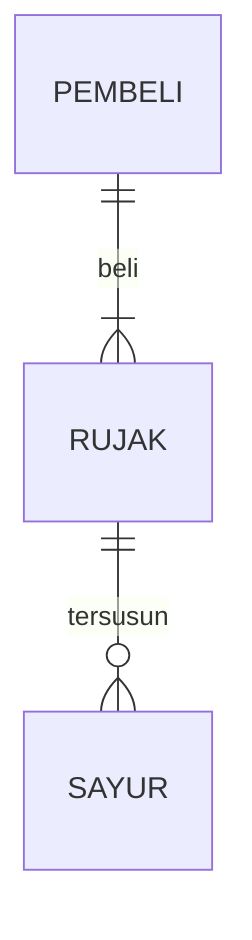

## 1.1 Latar Belakang

Latar belakang saya  membuat game ini yaitu sebagai wadah untuk menyalurkan pengetahuan dan keterampilan yang telah saya pelajari semasa pembelajaran, selama masa pengembangan game ini saya mempelajari banyak hal seperti, mendesain konsep game, tampilan game, alur game, dll. serta mempelajari juga bagaimana cara menerapkan kode dalam bahasa pemrograman sehingga menghasilkan sebuah fitur dalam game. Projek ini merupakan kesempatan yang berharga bagi saya sebagai tempat untuk menggabungkan pengetahuan dan keterampilan kedalam sebuah hasil projek berupa game. Alasan saya membuat konsep game seperti ini, karena saya terinspirasi dari game yang pernah mainkan sejak kecil yaitu game Diamond Rush.

## 1.2. Deksripsi Teknologi Informasi

Ruby adalah seorang pencari harta karun, dia harus mengumpulkan koin terlebih dahulu untuk menuju ke pos, di pos tersebut dia akan mendapatkan petunjuk. Ruby harus mengikuti semua petunjuk yang bersumber dari catatan di pos yang dia kunjungi untuk mendapatkan kunci dan jalan menuju peti harta karun. Namun, di tengah permainan Ruby juga harus melewati beberapa rintangan agar bisa mendapatkan harta karun tersebut.

## 1.3. Branding

1.3.1 Nama / Merk Game:
      Diamond Treasure Hunter 

1.3.2 Deskripsi Target
      Anak anak usia 8 tahun ke atas

1.3.3 Genre :
      Edukasi
      
## 2. User Story

Sebagai | Saya ingin bisa | Sehingga | Prioritas
---|---|---|---
Player | Berjalan kemana mana |Bisa Mencari petunjuk|⭐⭐⭐⭐⭐
Player | Mengumpulkan koin |Bisa  mendapatkan petunjuk dari pos | ⭐⭐⭐⭐⭐
Player | Mendapatkan Kunci |Membuka peti harta karun |⭐⭐⭐⭐⭐
Player | Melewati rintangan |Bisa melanjutkan mencari petunjuk|⭐⭐⭐⭐

## 3. Struktur Data

Cara membuat aneka macam bentuk grafik menggunakan mermaid.js bisa lihat di [https://mermaid.js.org/syntax/entityRelationshipDiagram.html](https://mermaid.js.org/syntax/entityRelationshipDiagram.html) 

## 4. Arsitektur Sistem

Masih pake mermaid.js juga bisa lihat flowchart di [https://mermaid.js.org/syntax/flowchart.html](https://mermaid.js.org/syntax/flowchart.html)

## 5. Teknologi, Library, dan Framework

bla bla bla

## 6. Desain User Experience dan User Interface
(

## 7. Flowchart 

## 8. Prinsip - prinsip yang diterapkan dalam game
      - Variable
      - Data Type
      - Operator
      - Boolean
      - Conditions: if / else / switch
      - Looping: while / for
      - Array
      - Method
      - Class

## 9. Demonstrasi Video

Link youtube nya

## 10. Bagaimana mesin komputasi dan sistem operasi berperan dalam produk teknologi informasimu ?

Link youtube nya di detik jawaban ini

## 11. Bagaimana algoritma, struktur data, dan bahasa pemrograman berperan dalam produk teknologi informasimu ?

Link youtube nya di detik jawaban ini

## 12. Bagaimana metode pengembangan perangkat lunak / Software Development Life Cycle berperan dalam produk teknologi informasimu ?

Link youtube nya di detik jawaban ini

## 13. Bagaimana database / sistem basis data berperan dalam produk teknologi informasimu ?

Link youtube nya di detik jawaban ini# job---interview---pdp.md
